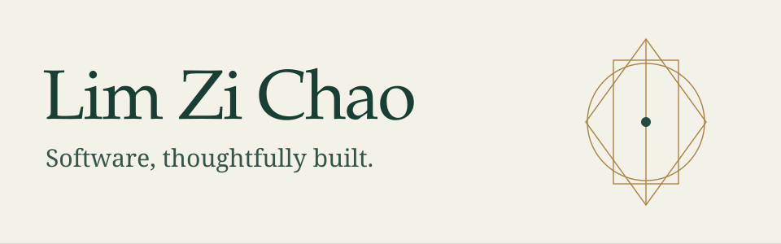

<!--
THESIS: A concise editorial portfolio, with engineering evidence leading the pitch.
OWN-WORLD: Forest, ivory, and muted gold; large serif lettering and precise geometry.
STORY: Meet Lim Zi Chao, explore Plutus and Green Chonk, then inspect the source.
FIRST VIEWPORT: Full-width masthead, short introduction, portfolio link, lead project.
FORM: User-approved restrained editorial direction; code-first; seed f60998b8.
FINISH: unreviewed and undocumented is unfinished; this build ends with the finish review, the verdict, DESIGN.md, and every shipping raster carrying its provenance
-->

**Computer Science at the National University of Singapore.**

I build applications with clear interfaces and dependable foundations.
My work spans full-stack web development and desktop software, with a focus on
readable design, reliable data handling, and tests that cover the details.

[**Visit my portfolio**](https://www.limzichao.com/)

 

## Selected work

**NUS Orbital · Apollo-level project** &nbsp; · &nbsp; Team Two Sicilies

A financial intelligence application bringing wealth tracking, portfolio
visibility, and transaction workflows into one project. Built with a Next.js
frontend, a FastAPI backend, and PostgreSQL.

TypeScript &nbsp; / &nbsp; React &amp; Next.js &nbsp; / &nbsp; Python &amp; FastAPI &nbsp; / &nbsp; PostgreSQL

[**Explore the project**](https://github.com/lzc-nus/Plutus#readme) &nbsp; · &nbsp; [Source code](https://github.com/lzc-nus/Plutus)

 

**CS2103T · Individual project**

A JavaFX task companion that pairs a chat interface with keyboard-driven
commands. Organize todos, deadlines, and events; search, edit, and see what
is scheduled for a date.

Separate command, domain, and storage responsibilities keep the code navigable.
Atomic saves protect task data, while JUnit, Checkstyle, coverage gates, and
cross-platform CI help catch regressions.

Java &nbsp; / &nbsp; JavaFX &nbsp; / &nbsp; Gradle &nbsp; / &nbsp; JUnit &nbsp; / &nbsp; GitHub Actions

[**Try Green Chonk**](https://github.com/lzc-nus/ip/releases/latest) &nbsp; · &nbsp; [User guide](https://lzc-nus.github.io/ip/) &nbsp; · &nbsp; [Source code](https://github.com/lzc-nus/ip)

 

## How I approach the work

**Make it understandable.** Clear responsibilities, focused commits, and
documentation that helps the next person get started.

**Make it dependable.** Validate inputs, test failure paths, and take extra
care where user data is involved.

**Keep it maintainable.** Favor cohesive modules, low coupling, and regression
tests so fixes and refactoring remain straightforward.

**Make it extensible.** Use clear interfaces and sensible boundaries so new
features can fit naturally without unnecessary rewrites or premature complexity.

**Keep improving it.** Use code review and automated checks to turn working
software into something easier to maintain.

---

[limzichao.com](https://www.limzichao.com/) &nbsp; · &nbsp; Building and learning at NUS.
